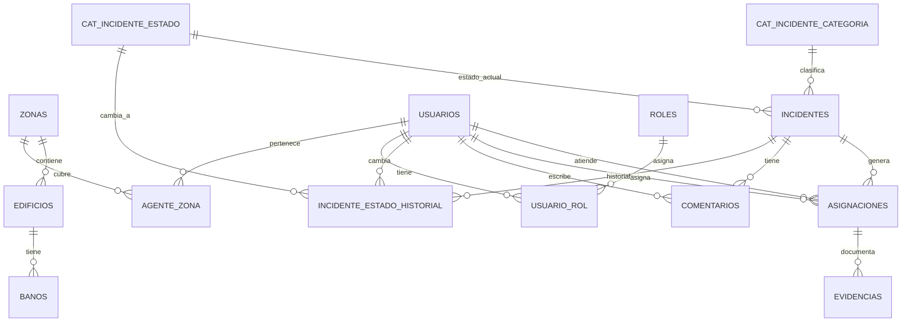

# SIR ACATLÁN - API
Esta es la documentación de cosas que se me van ocurriendo o que voy recordando sobre la api de SIR Acatlán, en donde intentaré explicar la estructura de la aplicación y darle algún tipo de justificación para que sepas cómo funciona, cómo desplegarla y cómo agregarle cosas a esto.

## Estructura del proyecto
Se elige esta estructura porque es mantenible, cumple con los criterios de arquitectura limpia. Usa un MVC desacoplado.
- El index es el unico punto de entrada y aisla del exterior el resto del código
- Se hace la sanitización de las peticiones en Request
- Response devuele una respuesta con un formato estandar.
```
project-root/
├─ public/
│  └─ index.php           # Front controller, única puerta de entrada
├─ src/
│  ├─ Core/
│  │  ├─ Request.php      # Encapsula $_GET/$_POST/headers/body
│  │  ├─ Response.php     # Construye respuestas JSON
│  │  └─ Router.php       # Router que envuelve el switch
│  ├─ Controller/
│  │  └─ UserController.php
│  ├─ Service/
│  │  └─ UserService.php  # Lógica de negocio (reglas, validaciones complejas)
│  ├─ Repository/
│  │  └─ UserRepository.php # Acceso a BD con PDO
│  └─ Model/
│     └─ User.php         # Entidad/DTO
├─ config/
│  └─ database.php        # Factoria de PDO o array de config
├─ storage/
│  ├─ logs/
│  └─ cache/
├─ .env
├─ .env.example
├─ composer.json
└─ vendor/
```
"Una arquitectura MVC con patrón Front Controller, Capa de Servicios y Repositorio, orquestada mediante Inyección de Dependencias."

Patrones de diseño usados:
- Front Controller
- Service Layer Pattern
Es el patrón que dicta: "Los Controladores deben ser 'flacos' (Thin Controllers) y los Modelos/Servicios 'gordos' (Fat Services)"
- Repository Pattern
Abstrae la base de datos
- Dependency Injection

Uso `Wiring` manual desde un bootstrap

## Cómo agregar/quitar funciones

1. Nivel Base
Define la estructura de datos. Es un espejo de tu tabla SQL en forma de objeto.
- Acción: Creas la clase con propiedades públicas en el constructor.
- Código clave:
```
namespace App\Model;
class Report {
    public function __construct(
        public int $id,
        public string $title,
        public string $status
    ) {}
}
```
2. Nivel Acceso a Datos: El Repositorio (src/Repository/ReportRepository.php)
Define CÓMO hablar con la base de datos. Aquí va el SQL puro.
- Requisito: Debe recibir PDO en el constructor.
- Acción: Creas métodos como save(), findAll().
- Código clave:
```
public function __construct(private \PDO $db) {} // Inyección
public function save(...) { $stmt = $this->db->prepare(...); }
```
3. Nivel Lógica: El Servicio (src/Service/ReportService.php)
Define las Reglas del Negocio. Aquí validas, calculas o transformas datos.
- Requisito: Debe recibir el ReportRepository.
- Acción: Validar que el título no esté vacío, etc., y llamar al repositorio.
- Código clave:
```
public function __construct(private ReportRepository $repo) {}
public function createReport($data) {
   // Validaciones...
   $this->repo->save($data);
}
```
4. Nivel HTTP: El Controlador `(src/Controller/ReportController.php)`
Define la Entrada y Salida. Recibe JSON y devuelve JSON.
- Requisito: Debe recibir el ReportService.
- Acción: Leer el Request, llamar al servicio y usar Response::json.
- Código clave:
```
public function __construct(private ReportService $service) {}
public function create(Request $request) {
    $data = $request->getBody();
    $this->service->createReport($data);
    Response::json(['msg' => 'Creado'], 201);
}
```
El "Wiring" (Conexión): config/bootstrap.php
Este paso es vital. PHP no sabe que creaste esos archivos hasta que los registras en tu Contenedor de Dependencias. Debes "enseñarle" al contenedor cómo armar la muñeca rusa.
Agregas esto al final de tus binds existentes:
```
// 1. El Repo necesita PDO (que ya registraste antes)
$container->bind(ReportRepository::class, function($c) {
    return new ReportRepository($c->get(PDO::class));
});

// 2. El Servicio necesita el Repo
$container->bind(ReportService::class, function($c) {
    return new ReportService($c->get(ReportRepository::class));
});

// 3. El Controlador necesita el Servicio
$container->bind(ReportController::class, function($c) {
    return new ReportController($c->get(ReportService::class));
});
```
El Switch (La Ruta): public/index.php
Finalmente, expones la funcionalidad al mundo. Agregas un nuevo case en tu switch principal.
Ubicación: Dentro del bloque `try { switch ($path) { ... } }`.
```
// ... otros casos ...

    case '/api/reports':
        // A. Si quieren CREAR (POST)
        if ($method === 'POST') {
            // Pedimos el controlador YA ARMADO al contenedor
            $controller = $container->get(ReportController::class);
            $controller->create($request);
        }
        // B. Si quieren LEER (GET) - Opcional
        elseif ($method === 'GET') {
            $controller = $container->get(ReportController::class);
            $controller->getAll($request);
        }
        else {
            Response::json(['error' => 'Método no permitido'], 405);
        }
        break;

    // ... default ...
```
Resumen:
1. Request llega a index.php → Entra al switch.
2. Switch pide Controller → Llama al Container.
3. Container arma todo → Controller + Service + Repo + PDO.
4. Ejecución → El código fluye hacia abajo (Controller -> Service -> Repo -> DB).
5. Respuesta → El resultado sube y Response::json lo envía al usuario.

## ✅ Checklist para agregar una nueva ruta (Sin fallar en el intento)

Sigue este orden estricto para implementar una nueva funcionalidad (ej. `Reports`):

1.  [ ] **Nivel Base (Model)**: Crea `src/Model/Report.php`. Define propiedades públicas y constructor.
2.  [ ] **Nivel Datos (Repository)**: Crea `src/Repository/ReportRepository.php`.
    *   [ ] Inyecta `PDO` en el constructor.
    *   [ ] Crea métodos SQL (`save`, `findById`, etc.).
3.  [ ] **Nivel Lógica (Service)**: Crea `src/Service/ReportService.php`.
    *   [ ] Inyecta `ReportRepository` en el constructor.
    *   [ ] Agrega validaciones y lógica de negocio.
4.  [ ] **Nivel HTTP (Controller)**: Crea `src/Controller/ReportController.php`.
    *   [ ] Inyecta `ReportService` en el constructor.
    *   [ ] Crea métodos que reciban `Request` y retornen `Response::json`.
5.  [ ] **Wiring (Bootstrap)**: Edita `config/bootstrap.php`.
    *   [ ] Registra `ReportRepository` (pasa `PDO`).
    *   [ ] Registra `ReportService` (pasa `ReportRepository`).
    *   [ ] Registra `ReportController` (pasa `ReportService`).
6.  [ ] **Routing (Index)**: Edita `public/index.php`.
    *   [ ] Agrega un nuevo `case '/api/reports':` dentro del switch.
    *   [ ] Obtén el controlador desde el container: `$container->get(ReportController::class)`.
    *   [ ] Llama al método según el verbo HTTP (`POST`, `GET`, etc.).

## Base de datos... (ptm)
Dado que al final nadie me pasó los catalogos de baños en la FES, me voy a inventar el cómo funciona para este MVP la relación de las bases de datos.
¿Cuáles son los datos? Bueno, creo que vamos a ir desmenuzandolos poco a poco.

1. Catalogos
   - Baños
   - Edificios
   - Zonas
   - categoria de incidencia
   - estado del incidente
   - estado de la asignación (nuevo, asignado... para admnins o tracking de folio)
   - resultado de la asignación

2. Identidad y permisos
   - usuarios
   - roles
   - relacion de usuarios v roles
   - zona del agente (?) si se llega a implementar... no c.

3. Operación
   - incidentes
   - historico del incidente (para trazabilidad)
   - asignaciones
   - evidencias
   - comentarios ?

